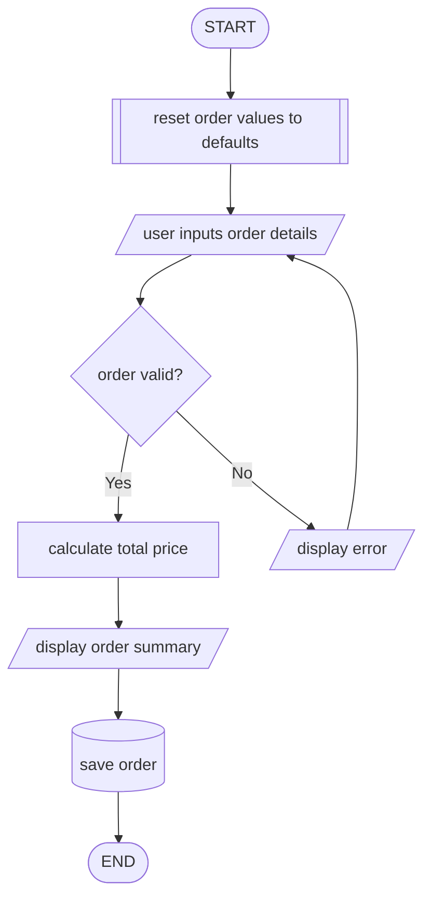

# stack-md-mermaid

contents:

[TOC]

---

```mermaid
graph TB
    id1([START])
    id1-->id10[[reset order values to defaults]]
    id10-->id20[/user inputs order details/]
    id20-->id30{order valid?}
    id30 -->|Yes| id40[calculate total price]
    id30 -->|No| id50[/display error/]-->id20
    id40-->id60[/display order summary/]
    id60-->id70[(save order)]
    id70-->id9999([END])
```
