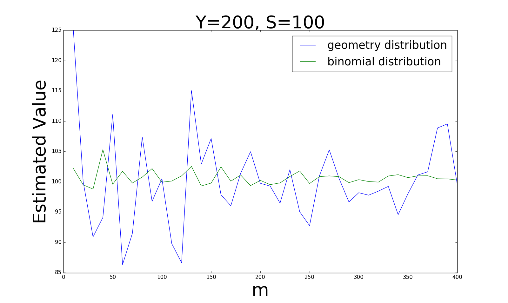
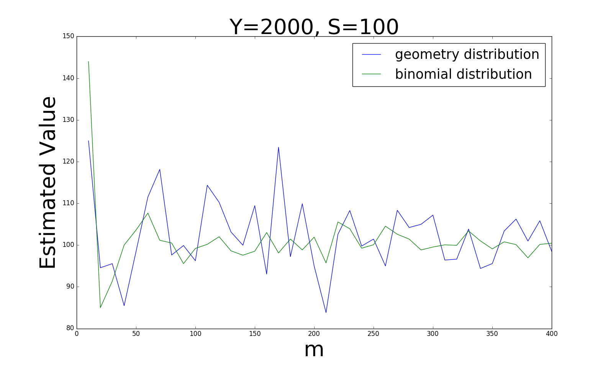
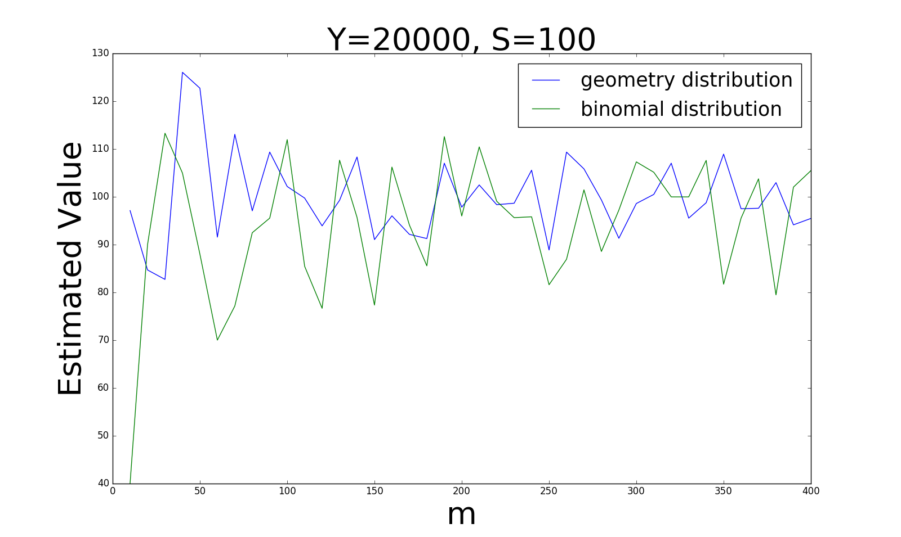
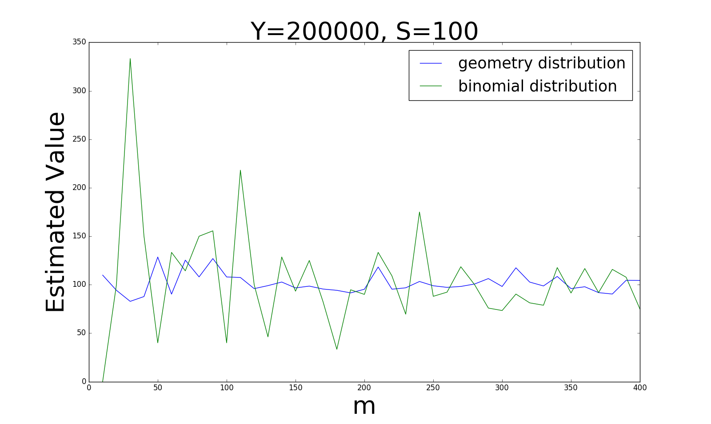
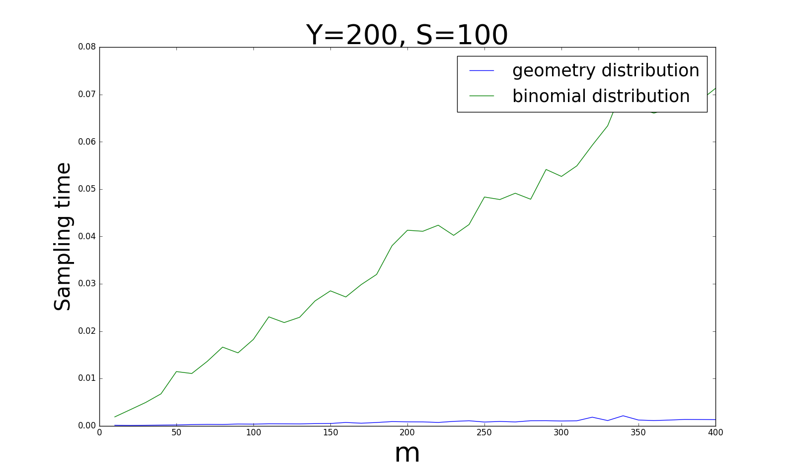
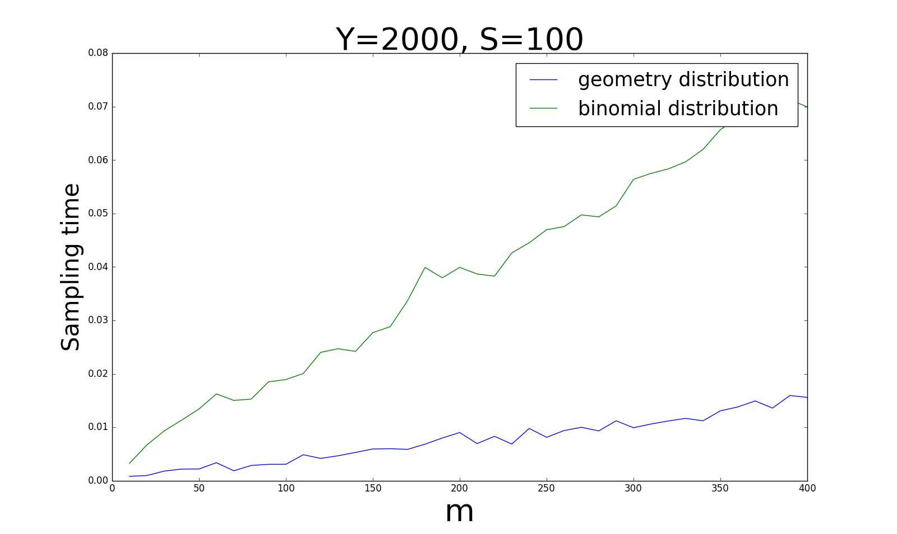
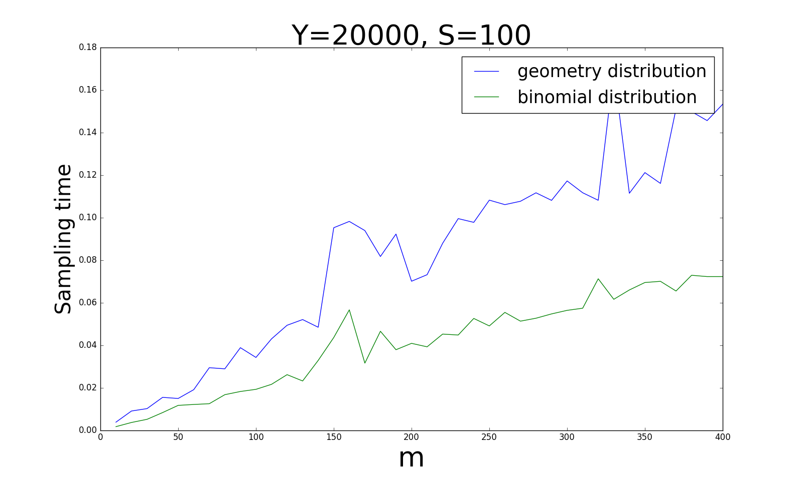
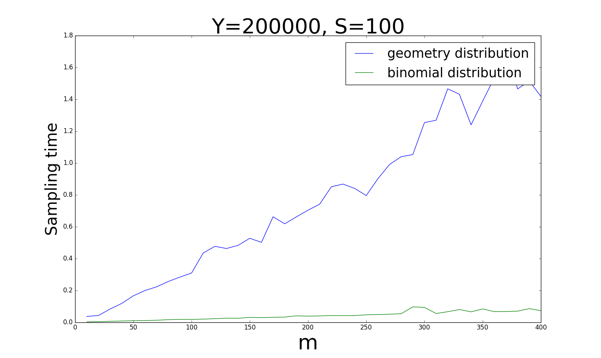

# Sampling Trick

***Contents***

[TOC]

---

> compare to https://yichuzhou.com/posts/sampling/

keywords: sampling, Geometric distribution, Bernoulli distribution
Category: Experience
Slug: Sampling-Trick
comment_id: Sampling-Trick

During the recent paper readings, I find that we need to
estimate the size of a subset from time to time.  This
subset comes from a extreme large set which means this
subset may also be extreme large.  The naive way to know the
size of this subset is to go through all the elements of
this subset.  However, because of the extreme large size, it
is impossible for us in practise.  So, what we need is a way
to estimate the size of subset quickly.  One of the typical
scenarios is the [Ranking Problem][].  In [Ranking
Problem][] problem, we need to know how many instances are
there ranking before the current instance.  And this
operation will be applied to each instance.  Apparently, it
is impossible for us to go through the whole training set.

## Sampling

An reasonable way is to estimate the size of subset based on sampling.

Let's first set up some backgrounds.  We assume the whole set is $Y$, its size
is denoted as $\vert Y\vert$.  Set $S\subset Y$ is the subset and $\vert
S\vert$ is what we need to estimate.

### Geometric Distribution

In the paper [@weston2011wsabie], it mentions a sampling method based on the geometric distribution.
The sampling process can be described as:

> Keep randomly choose(with replacement) an element $y$ from $Y$ until the element $y\in S$.
> Record the sampling times, denoted as $N$.
> Then, the size of $S$ can be estimated as $\vert S \vert=\frac{\vert Y \vert}{E[N]}\approx\frac{\vert Y\vert}{N}$.

Proof:

The proving process is very simple.
We use $p$ to denote the probability that element $y$ belongs to set $S$:

$$
p=Pr[y\in S] = \frac{\vert S \vert}{\vert Y \vert}
$$

Based on the sampling process, we can get:

$$
Pr[N=i]=(1-p)^{i-1}p
$$

When $N=i$, we sampled $i$ times, which means the previous $i-1$ times are all failed to pick the element belonging to $S$.
This is actually a geometric distribution, so its expectation is:

$$
E[N] = \frac{1}{p} = \frac{\vert Y\vert}{\vert S \vert}
$$

Transform the equation above:

$$
\vert S \vert = \frac{\vert Y \vert}{E[N]}
$$

Also, we know that when the sampling rounds  become infinity, the expirical value equals the expecation:

$$
E[N] = \lim\limits_{m\rightarrow\infty}\frac{1}{m}\sum\limits_{i=1}^m N_i
$$

where $N_i$ represents the sampling times in the $i^{th}$ round of sampling.
In order to estimate quickly, we can set $m=1$, then we finally get:

$$
\vert S\vert \approx \frac{\vert Y\vert}{N}
$$

$\blacksquare$

### Bernoulli Distribution

Apart from the previous sampling method, there are actually other ways.
One of the choices is to use bernoulli distribution.
The process is as following:

> Keep randomly choose(with replacement) an element $y$ from $Y$ for $N$ times, then check how many elements in this $N$ elements that belong to $S$, which is denoted as $N$.
> Clearly, $M < N$.
> Then, the size of $S$ can be estimated as $\vert S\vert=\frac{E[M]\vert Y \vert}{N}\approx \frac{M\vert Y \vert}{N}$.

Proof:

Similarily, we use $p$ to denote the probability that any element $y\in Y$ belongs to $S$:

$$
p=Pr[y\in S] = \frac{\vert S \vert}{\vert Y\vert}
$$

Based on this sampling method, we know:

$$
Pr[M=i] = \binom{N}{i}(1-p)^{N-i}p^i
$$

This means we independently choose(with replacement) $N$ elements from $Y$, in which contains $i$ elements that belong to $S$.
This actually a bernoulli distribution, so its expecation is:

$$
E[M] = pN = \frac{\vert S \vert}{\vert Y\vert}\cdot N
$$

Rewrite this as:

$$
\vert S\vert = \frac{E[M]}{N}\cdot \vert Y\vert
$$

Based on the defintion of expectation:

$$
E[M] = \lim\limits_{m\rightarrow\infty}\frac{1}{m}\sum\limits_{i=1}^m M_i
$$

Similarily, we can set $m=1$, then we can get:

$$
\vert S\vert\approx \frac{M\vert Y\vert}{N}
$$

$\blacksquare$

## Experiments

To compare the difference between these two different methods, I did some experiments.
The results are showed as following.

### Accuracy

I first compare the accuracy of estimation of these two sampling methods.
I got 4 different plots based on different ratios of $\vert Y\vert$ and $\vert S \vert$.

From these four plots, we can conclude:

**When the ratio of $\vert Y\vert$ and $\vert S \vert$ is larger($0.5$), bernoulli distribution is more stable; when the ratio becomes smaller($0.0005$), geometric distribution is becoming more stable.**

### Time

Another important aspect of sampling is the time.
After all, all we want is to accelerate the computation.
The following 4 polts show the comparison of time based on the same settings.

## Conclusion

**When the ratio of $\vert Y\vert$ and $\vert S \vert$ is larger($0.5$), geometric  distribution is faster than bernoulli distribution; when the ratio becomes smaller($0.0005$), geometric distribution takes more and more time and bernoulli distribution will take the advantage.**

[Ranking Problem]: https://en.wikipedia.org/wiki/Learning_to_rank

## References

- [ ] howto generate from bib
