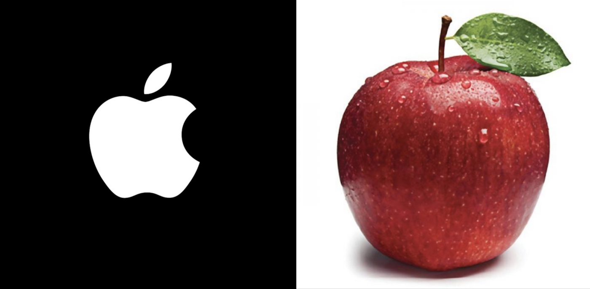
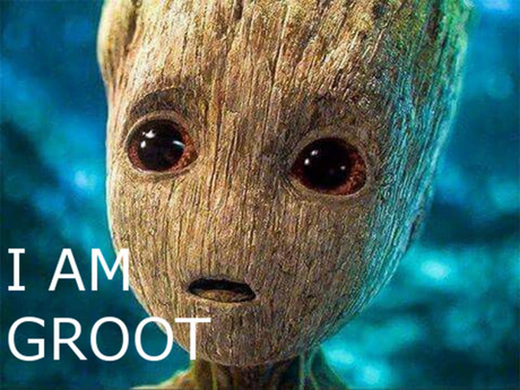

# A Little History of Word Representation

***Contents***

[TOC]

---

> compare to https://yichuzhou.com/posts/a-little-history-of-word-representation/

Category: Word-Representations
Keywords: word embeddings, word2vec
Slug: a-little-history-of-word-representation
Comment_id: a-little-history-of-word-representation

As a semi-computer scientist, I always dream that we,
humans, can make the computers understand what we say.
Instead of writing sophisticated code or using other input
devices (a mouse and a keyboard) to give instructions to
computers, we can directly talk to a computer and give
instructions. The first step to accomplish this science
fiction scene is to let the computer understand what we say
-- natural languages, which is the ultimate target of
**natural language processing(NLP)** research. The first
step to making computers understand natural languages is to
represent the fundamental element of natural language,
**words**, as a form that computers can understand. This
raises a big research direction in NLP: **word
representations**. This is the sub-area I am interested most
in NLP. In this series post, I am going to present some
vital research work on this topic. 

In this very first post, I will first explain why do we need
a different representation for computers and what we have
done in this path.  I want to present a "map" in this area
to understand where we are on the road to our
ultimate target: **giving instructions to computers by
talking.**

# Why Representing Words

<!--
Language is the most important characteristic of human that
can distinguish us from other animals. Although some animals
like dolphin can also communcate with each other, they can
not express complex objects or concepts. Language is the
unique ability of human. It enables us to communicate with
each other, exchange ideas and pass on knowledge. However,
when we sit down to think about what is language, we find
that language is just a sequence of words or symbols that
orgainized by some grammar or pattern. Humans can translate
their thoughts into a sequence of symbols and another one
then can translate that sequence back to thoughts. This
process may happen without even us realizing it. However,
with the development of modern information technology, we
start to wonder, can we make the computers to understand
what we say without any sophisticated coding or device?
-->

Although talking to a computer is a very appealing idea, in
reality, it is still a hard problem. Why? Because computers
"think" differently from humans. Language is full of
ambiguity, which is somehow an advantage because it enables
us to use a finite set of symbols to describe this infinite
world. However, this ambiguity does not work for computers.
Computers can not understand this ambiguity because it only
deals with numbers, which is deterministic. For example,
computers can perform adding or multiplying operations, but
computers can not understand the difference between the
fruit "Apple" and the company "Apple". To computers, these
two words are the same symbol and thus represent the same
meaning.

To let computers understand the ambiguity of natural
language, we need to "translate" natural language into some
representations that computers enjoy. The primary element of
this translation is to translate words because words are the
smallest element that contains semantic meaning. Over the
years, researchers developed many different representing
methods. These representing methods evolved through various
stages. Following is a summary of all these different
representing methods.

# Representing Methods
In the field of word representation, researchers have gone a
long way. Here, I try to divide the representing history
into different stages. Be note, and this is only my
perspective and not a standard division.

- Prehistory: **Dictionary lookup**
- Middle Age: **one-hot encoding, bag-of-words**
- The Enlightenment: **Vector space model and distributed
  representations**
- Industrial Age: **Type vector(word2vec, Fasttext)**
- Modern Age: **Token vector(ELMo and BERT)**

In this post, I will briefly talk about these different
methods. More details will be presented in the following
posts.

# Prehistory: Dictionary Lookup

Dictionary lookup is a straightforward idea that may exist
long before computers (that's why I call it prehistory). One
sentence can describe this method: **Map each word to a
unique number**.  This unique number is used as the
representation of the corresponding word. 

Suppose we have a small language, which only consists of
three words: *I*, *am*, and *groot*. Now, we need to create
a representation of these three words. By assigning each
word a unique number, we can create a lookup dictionary
shown below:

| Words | ID |
|  :--: |:--:|
| *I* | 0 |
| *am* | 1 |
| *groot* | 2 |

By creating such a mapping relation (*i*$\rightarrow 0$,
*am*$\rightarrow 1$, *groot*$\rightarrow 2$), we
successfully represent the whole language into numbers,
which can be understood by computers. For each given word,
we can return its representation by looking it up in the
dictionary. Although this is a simple idea, it builds the
fundamentals for all other "modern"  methods.

A straightforward example is showed in the following figure:

This figure is a table of [morse code][]. Here, each letter
is mapped to *dots* and *dashes*. This figure composes a
simple dictionary. [Morese code][morse code] exists long
before the creation of computers. This is why I call the
dictionary lookup a prehistory representation method.

Since we call it prehistory, it must have many problems.
Mapping to numbers is the only advantage of this
dictionary lookup method. There are many drawbacks to this
method. 

- **Impose the ordering of words.** By mapping each word
  into an integer, this representation imposes an ordering
  of words that do not exist. For example, consider *I*
  $\rightarrow 0$ and *am* $\rightarrow 1$, computers think
  *am* is more important than *I* because $1$ is greater
  than $0$. This is a wrong assumption.
- **Integers do not contain information.** Although we can
  map each word into an integer, an integer is merely
  another symbol. It does not carry any semantic meaning.
- **The dictionary will grow to infinite.** In our small
  language, we only have three words. In reality, we face
  unlimited word vocabulary (we are creating new words every
  day), which means the dictionary keeps growing forever.

To overcome all these drawbacks, researchers keep trying to
develop new representation methods, which leads us to the
next stage: **Middle Age**.

# Middle Age: One-hot and Bag-of-Words

Now, we are entering the middle age of word representation.
In this age, **[one-hot encoding][one-hot]**, along with its
variants, **[Bag-of-words][BoW]**, becomes the most commonly used
method.

## One-hot Represention
The idea of one-hot representation is also simple: **Create
a vector with filled zeros except one that you want to
represent**. Following the example language of *I am groot*,
we can have three vectors with a size of $4$:

| | *I* | *am* | *groot* | UNKNOWN | 
| :--: |  :--: | :--: | :--: | :--: |
| *I* | 1  | 0 | 0 | 0 |
| *am* | 0  | 1 | 0 | 0 |
| *groot* | 0  | 0 | 1 | 0 |

As we can see here, each dimension represents one word. Only
the word that needs to be represented is set to $1$. For
example, word *I* is represented as $[1, 0, 0, 0]$. The
extra dimension is used for out of vocabulary words.

The most important advantage of this representation is it
can eliminate the wrong ordering assumption of [Dictionary
Lookup](#prehistory-dictionary-lookup). Each word is
represented equally. However, this representation still
suffers the other two drawbacks of [Dictionary
Lookup](#prehistory-dictionary-lookup): 

- Each vector hardly carray any semantic informtion; 
- when the vocabulary becomes large, this representation
  requires large space of memory.

## Bag-of-Words
Although there are drawbacks to one-hot representation, it
was widely used years ago. One important extension is
[Bag-of-Words][BoW] representation. Instead of representing
a single word, Bag-of-Words usually is used to represent a
sentence or a document. One can see the Bag-of-Words as the
summation of one-hot representations of each word in one
sentence. Following are two example sentences composed by
our example *I am groot* language:

- *I am groot*:

    $[1,1,1,0]=[1,0,0,0]_{\text{I}}+[0,1,0,0]_{\text{am}}+[0,0,1,0]_{\text{groot}}$.

- *I am not groot*:

    $[1,1,1,1]=[1,0,0,0]_{\text{I}}+[0,1,0,0]_{\text{am}}+[0,0,0,1]_{\text{not}}+[0,0,1,0]_{\text{groot}}$

Because *not* does not belong to the language vocabulary, we
have to use the UNKNOWN dimension to represent it.

Bag-of-Words suffers several drawbacks:

- It ignores the position information in the sentence. For
  example, we can not differentiate two sentences: "*I am
  groot not*" and "*I am not groot*" using Bag-of-Words.
- It needs a large memory space because the dimension of
  these vectors equals vocabulary size, which is very large
  in practice.

# The Enlightenment: Word Embeddings 

The next stage is the enlightenment age, in which the two
most important ideas of representing words were proposed.
These two ideas make a significant impact on the research
history of natural language processing. 

<!--
The first insightful idea is:
**using a dense vector to represent words**. 
-->

<!-- A small example is needed here! -->

The first idea is a famous assumption:

> You shall know a word by the company it keeps

This assumption is proposed by [John Rupert Firth][]. I can
not find the exact source of this quotation. But I can find
a similar one in [@firth1935technique]:

> ... .the complete meaning of a word is always contextual,
> and no study of meaning apart from a complete context can
> be taken seriously.

This assumption lay the foundation of all following learning
models that produce word embeddings. What does this
assumption mean? It means that its context decides the
meaning of a word. For example, suppose we have the
following sentence:

$$
\text{The fluffy __ barked as it chased a cat.} 
$$

Which word should we fill in this blank? A simple guess is
*dog*. Why can we guess the meaning without knowing the
word? Because the context (other words in the sentence)
decides the meaning of this blank word. I think this
sentence can well explain the context assumption Firth
proposed.

The other important idea is the proposition of using a low
dimension dense vector to represent words.  Using a feature
learning model, each word is represented by a dense vector
with a fixed and lower dimension (compared to the size of
the dictionary). A critical property of this dense vector
is: **words with the same meaning will have a similar
vector**. We usually call this dense vector [word
emebedding][word embedding] or **distributed
representation**. In the following of this post, I will use
these two terms interchangeably. 

Let us see an example of what does a dense vector mean.
Recall that in the [One-hot
representation](#middle-age-one-hot-and-bag-of-words),  we
represent the word *groot* as a binary vector:

$$
\text{groot} \rightarrow [0, 0, 1, 0]
$$

In a dense vector,  *groot* represents as:

$$
\text{groot} \rightarrow  [2.56, -0.55, 5.30, -4.06, 0.82]
$$

The difference is in each dimension. We have real numbers
instead of all zeros. The dimension of this dense vector is
fixed. The size of vocabulary does not change the dimension.

The earliest detailed analysis of distributed representation
I can find is in Chapter 3 in **Parallel Distributed
Processing** [@@rumelhart1987parallel]. In this book,
distributed representations are analyzed thoroughly. I
suggest any who are interested in word embeddings should
read chapter 3 of **Parallel Distributed Processing**.

However, although two insightful ideas have been made,
distributed representations have not become popular because,
at that time, no good techniques were available to produce
high-quality word embeddings. This situation continues until
the year of 2003. In this year, [Yoshua Bengio][] published
the paper: *A neural probabilistic language model*
[@@bengio2003neural]. In this paper, Bengio puts the idea of
word embeddings into the context of neural networks. By
training a neural network, the model can naturally produce a
vector for each word. Starting from this paper, people began
to review the idea of distributed representation.

# Industrial Age: Type Vector

Although [Yoshua Bengio][] pointed a bright way to produce
word embeddings, it is costly to train word embeddings
because the neural network involves a lot of computations.
The word embedding model was still not a hot topic in the
NLP field for about ten years. 

In 2013, a team at [Google][] led by [Tomas Mikolov][]
published a word embedding toolkit [word2vec][], which can
train word embeddings faster than previous approaches. It is
this [word2vec][] model that makes the word embedding idea
take off. Mikolov's famous paper: "Efficient estimation of
word representations in vector space"
[@@mikolov2013efficient] received more than $10,000$
citations in just a few years. [Word2vec][word2vec] provides
a simple algorithm to produce word embeddings from the
unlabelled text. These embeddings have several important
properties that attract people. The most impressive property
is the similarities between words. One famous example is:

$$
\vec{\text{king}} - \vec{\text{man}} + \vec{\text{woman}} \approx \vec{\text{queen}}
$$

This example shows that word embedding produced by
[word2vec][] at least captures some semantic meanings of
words. Our representation finally is not just some
meaningless symbols. It can carry meanings of words.

I call this Industrial Age because it is similar to the
[Industrial Age][] in human history, significant
improvements have been made for productive forces. Since the
publication of word2vec, more research has been done
following the direction of distributed representations. In
the next year of the creation of word2vec, almost every NLP
task has been integrated with word embeddings.

However, although [word2vec][] can achieve the best
performance on many NLP tasks at that time, people find some
drawbacks of the word2vec-style models.

- First, if one word does not show in the training set,
  word2vec can not produce representation for it, known as
  out-of-vocabulary(OOV) problem.
- Words with multiple meanings can not be represented
  correctly. 

To overcome the OOV problem, [Facebook's AI Research (FAIR)
lab][FAIR] created another famous embedding model in 2017:
[fastText][][@@bojanowski2017enriching]. One advantage of
[fastText][] is it can produce embeddings for
out-of-vocabulary words. Now, fastText has replaced word2vec
to become the baseline for other embedding models.

Before entering the next age, we need to understand the
difference between two concepts: **type vector** and **token
vector**.

Type Vector
:   Type vector means context-independent. The same word in
different sentences (contexts) has the same representation.
For example, the word "bank" in the sentence "I need to
deposit some money to the bank" and "I am walking along the
river bank" has the same representation.

Token Vector
:   Token vector means context-dependent. The same word in the
different sentence (contexts) has different representations.
For example, the word "bank" in the sentence "I need to
deposit some money to the bank" and "I am walking along the
river bank" have entirely different representations because
the word "bank" represents different meanings in these two
sentences.

Clearly, [word2vec][] produces the type vector. We will talk
about the token vector in the next age.

# Modern Age: Token Vector

If the creation of type vector (word2vec model) marks the
age of industry, then the creation of [BERT][] marks the
modern era. In 2018, [Google][] published another important
paper in word representation history: "BERT: Pre-training of
Deep Bidirectional Transformers for Language
Understanding"[@@devlin2019bert]. In less than two years, it
already received more than $7,000$ citations from the NLP
community.

[BERT][] almost improves every single NLP task. The authors
of [BERT][] call it [the new era of NLP][BERT-claim].
Instead of creating an embedding for each type word,
[BERT][] creates embeddings for tokens. It generalizes
[word2vec][]-style models from type vector to token vector.
For example, the word "Bank" in sentences "I need to deposit
some money to the bank" and "I am walking along the river
bank" have completely different representations. 

Also, [BERT][] creates a new scheme of using word
embeddings. Previously, we train our embedding learning
models on some unlabelled text and apply these embeddings to
a specific task without updating the embedding models. By
using BERT, we train BERT on large unlabelled text corpus,
then fine-tune on the specific task to adjust (update) the
BERT model to a specific task to achieve better performance.
After fine-tuning, the model is applied to the test set.

Like the creation of [word2vec][], after the creation of
[BERT][], there are many other related models and works
proposed. [BERT][] becomes a hot topic in recent years.
Although [BERT][] may create a new representation era for
us, there are still many unknown to us.

# Summary

In this post, I summarize the development history of word
representations straightforwardly. I did not mention a lot
of excellent work in this post (I will talk about them in
other posts) because I want to make this post compact enough
to deliver the whole picture of the research of word
representations. I also ignore all the details of the models
I mentioned in this post. This post is not about
explanations of models but clears the development history.
In each age, I strengthen the improvement point to show why
models in the new era can mark a new era.

Starting from this post, I will keep writing research work
about the word representation field. I hope you enjoy this
series of posts.

[one-hot]: https://en.wikipedia.org/wiki/One-hot "One-hot representation"
[BoW]: https://en.wikipedia.org/wiki/Bag-of-words_model "Bag-of-Words"
[word embedding]: https://en.wikipedia.org/wiki/Word_embedding "Word embedding"
[John Rupert Firth]: https://en.wikipedia.org/wiki/John_Rupert_Firth
[Parallel Distributed Processing]: http://web.stanford.edu/~jlmcc/papers/PDP/
[Yoshua Bengio]: https://en.wikipedia.org/wiki/Yoshua_Bengio
[Google]: https://en.wikipedia.org/wiki/Google
[Tomas Mikolov]: https://en.wikipedia.org/wiki/Tomas_Mikolov
[word2vec]:https://en.wikipedia.org/wiki/Word2vec
[FAIR]: https://ai.facebook.com/research/
[fastText]: https://fasttext.cc/
[BERT]: https://en.wikipedia.org/wiki/BERT_(language_model)
[BERT-claim]: https://twitter.com/lmthang/status/1050543868041555969?lang=en
[morse code]: https://en.wikipedia.org/wiki/Morse_code
[Industrial Age]:https://en.wikipedia.org/wiki/Industrial_Age
