# A Closer Look at How Fine tuning Changes BERT

***Contents***

[TOC]

---

## Fine Tuning

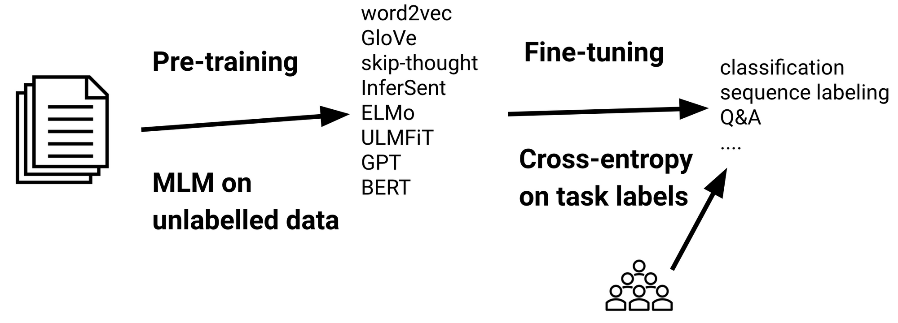

Fine-tuning a pre-trained model on a specific task becomes a
standard strategy to improve the task performance. However,
very little is understood about how fine-tuning process
affects the underlying representation and why fine-tuning
invariably seems to improve the performance.

We applied two probing methods, classifier-based probing and
[DirectProbe](./2020-12-08-direct-probe.md) on variants of BERT
representations and tasks. In this post, 

- We show that **fine-tuning introduces a divergence between
  training and test sets.{@style=color:maroon}** We also
  discover one exception where fine-tuning hurts the
  performance.
- We reveal two reasons why fine-tuning can improve the
  performance: **(i) Fine-tuning adjusts the representation
  such that it groups points with the label into a smaller
  number of clusters (ideally one); (ii) Fine-tuning pushes
  the clusters of points representing different labels away
  from each other, producing a larger separating regions
  between labels.{@style=color:darkorange}**
- By investigating the effect of across tasks fine-tuning,
  we verify the hypothesis that **fine-tuning improve the task
  performance by altering the distances between label
  clusters.{@style=color:darkorange}**
- We show that **lower layers do change during the fine-tuning,
  but to a much lesser extent than the higher ones.{@style=color:royalblue}**

## Probing methods

To analyze how fine-tuning works, we use two probing methods
to analyze the represention space before and after
fine-tuning process.

### Classifiers as Probes

The first probe we used is a classifier-based probe, which
is a common methodology to probe representation space. We
train classifiers over representations to understand how
well a representation encodes the labels for a task.  For
all of our analysis, we use two-layer neural networks as our
probes. The classification performance can provide a direct
assessment of the effect of fine-tuning.

### DirectProbe: Probing the Geometric Structure

The second probe we used is [DirectProbe](./2020-12-08-direct-probe.md),
a recently proposed technique which analyzes representation
space from a geometric perspective by clustering. Different
from the other probes that analyze the geomtry of the
representations, DirectProbe requires a representation and a
given labeling task. It is reasonable to probe the
representation based on a give task because fine-tuning a
representation creates different representations for
different tasks.

DirectProbe is built on upon the categorizetion of not one,
but *all* decision boundaries in a representation space that
are consistent with the a training set for a given task. It
approximates this set of decision boundaries by a supervised
clustering algorithm, which returns a set of clusters such
that each cluster only contains the points with the same
label. There are no overlaps between the convex hulls of
these clusters. The following figure describe this process.
More detailed description of DirectProbe can be found [here](./2020-12-08-direct-probe.md).

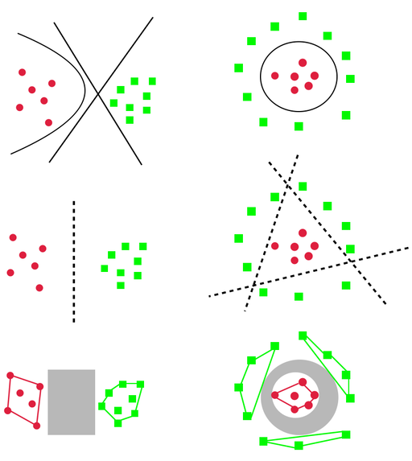{@style=text-align:center}

We use three properties of the clusters returned by
DirectProbe to measure the representations:

1. **Number of Clusters{@style=color:darkorange}**. The number of clusters can indicate
   the linearity of the representation for a task. If the
   number of clusters equal to the number of labels, then
   all the examples with the same label are grouped into the
   one cluster (left example in the above figure). One linear
   classifier is sufficient to describe the decision
   boundaries. In contrast, if the number of clusters are
   greater than the number of labels, then there are at
   least two clusters with the same label can not be grouped
   together (right example in the abobe figure). In this
   scenario, a non-linear classifier is required to separate
   labels from each other.
2. **Distances between Clusters{@style=color:royalblue}**. We use Euclidean distance
   as the metric to measure the distance between clusters.
   The distances between clusters can reveal the internal
   structure of the representation based on a given task. We
   can observe how fine-tuning process changes the
   representation by tracking the distances between these
   clusters. Instead of using the distances betwen centroids
   of each clusters or the distances between the closest
   examples from different clusters, we compute the
   distances using the fact that each cluster is a convex
   object. We use the max-margin separators to compute the
   distances. We train a linear SVM classifier to find the
   maximum margin separator and compute its margin. The
   distance between the two clusters is twice the margin.
3. **Spatial Similarity{@style=color:maroon}**. The
   distances between clusters can also be used to compare
   the spatial similarity between two representations. If
   two representations have similar relative distances
   between clusters, the representations themselves are
   simielar to each other.
   We construct a *distance vector $v$* using the distances
   between all the clusters. Each element $v_i$ is a
   distance between two clusters with different labels. With
   $n$ labels in a task, the size of $v$ is $\frac{n(n-1)}{2}$.
   **This construction works only when the number of
   clusters equal to the number of labels**, which is valid
   for most representations. We compute the Pearson
   correlation coefficient between distance vectors of two
   representations as the measure of the similarity of these
   two representations for a labeling task.

## Discoveries

In this section, we will go over all the observations and
discoveies we find during this probing work.

### Fine-tuned Performances

First, let's look at the fine-tuned classification
performance. We train a two-layer neural network as the
classifier to classify five tasks:

- POS tagging: POS
- Dependency relation: DEP
- Preposition supersense role: PS-role
- Preposition supersense function: PS-fxn
- Text classification: TREC-50

It is commonly accepted that the fine-tuning process
improves task performances. However, during our experiments,
we did find one exception that fine-tuning does not improve
the performance. 

**Fine-tuning Diverges the Training and Test Set {@style=color:maroon}**

The following table summarizes the classification
performances of all the representations and tasks.

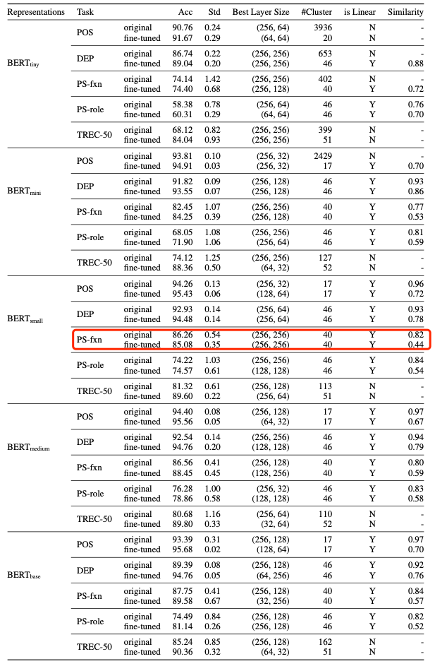{@style=text-align:center}

We observe that BERT-small does not show
improvments after fine-tuning process on supersense function
task, which seems to be odd considering in all other cases,
the fine-tuning improves the performance. In the meanwhile,
we also obsverve that after fine-tuning, the spaital
similarity between training and test set is decreasing
for all representations and tasks (showed in the last
column), indicating that the training and test sets
become divergent as a result of fine-tuning.

**Fine-tuning Memorizes Training Set {@style=color:maroon}**

To understand why BERT-small decreases the performance on
the supersense function task, we hypothesize that
fine-tuning can memorize the training set. To validate this
htpothesis, we design the following experiment:

- We divide the training set into two 80:20 parts, called
  the *subtrain* and *subtest* ses respectively.
- We fine-tuning the representations on the whole training
  set.
- Then we train a classifier using the *subtrain* set and test on
  the *subtest* and the real test set.

The difference bwtween the subtest and test sets are,
subtest is used during fine-tuning but not visible to the
classifiers. The following table summarizes the visibility.

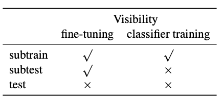{@style=text-align:center}

By comparing the learning curves of subtest and test set, we
can verify if the fine-tuning process memorizes the subtest.
We conduct our experiments on the four tasks using
BERT-small. The following figures show the results.

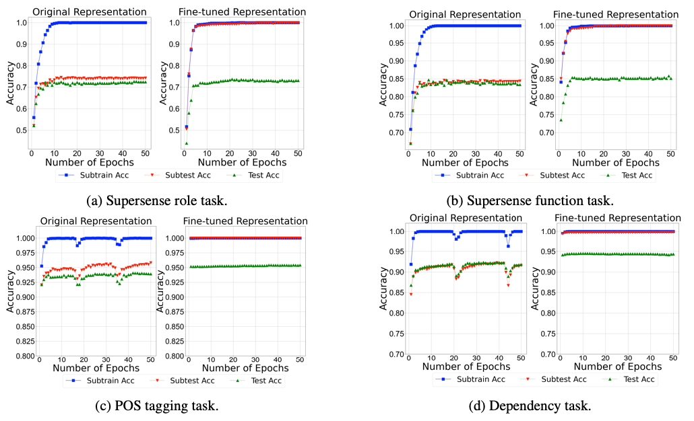{@style=text-align:center}

In the above figures, we can observe that before fine-tuning,
subtest and test have a similar learning curve; while after
fine-tuning, subtrain and subtest have a similar curve
although subtest is not visible for classifier training.
This observations means that the representation memorizes
the subtest during the fine-tuning process such that
subtrain and subtest share the exactly the same regularity.
Although this observation of memorization cannot explain why
BERT does not improve the performance after fine-tuning, it
points to a possible direction for investigation: If the
memorization beomes severe, will the fine-tuning process
overfit the training set and cannot generalize to unseen
examples? We leave this question for future research.

### Linearity of Representations

After analyzing the performance of fine-tuning, we will
take a deeper step to see the geometric change during
fine-tuning. In this subsection, we will focus on the linearity
of the representations by comparing the number of clusters
produced by DirectProbe before and after fine-tuning.

**Smaller Representations Require More Complex Classifiers {@style=color:darkorange}**

The following table summarizes the results on BERT-tiny. We
only show BERt-tiny here because other representations are
linearly separable even before fine-tuning. In the following
table, we observe that small representations such as
BERT-tiny are non-linear for most of the tasks. Although a
non-linearity does not necessarily imply poor generalizaiton,
it represents a more complex spatial structure and requires
a more complex classifier. It would be advisable to use a
non-linear classifier if we want to use a small
representations (say due to limited resources).

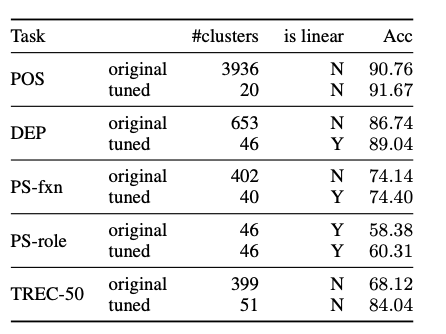{@style=text-align:center}

**Fine-tuning Makes the Space Simpler {@style=color:darkorange}**

In the above table, we also observe that after fine-tuning,
the number of clusters decreases, suggesting that
fine-tuning updates the space such that points with
different labels are in a simpler spatial configuration.

### Spatial Structure of Labels

Next, let's analyze the spatial structure of the
representations during fine-tuning. In this subsection, we
focus on tracking the distance between clusters and how
these clusters move.

**Fine-tuning Pushes Each Label Away From Each Other {@style=color:darkorange}**

We track the minimum distance of each label to all other
labels during fine-tuning[^1]. The following figure shows
these distances change in the last layer of BERT-base.

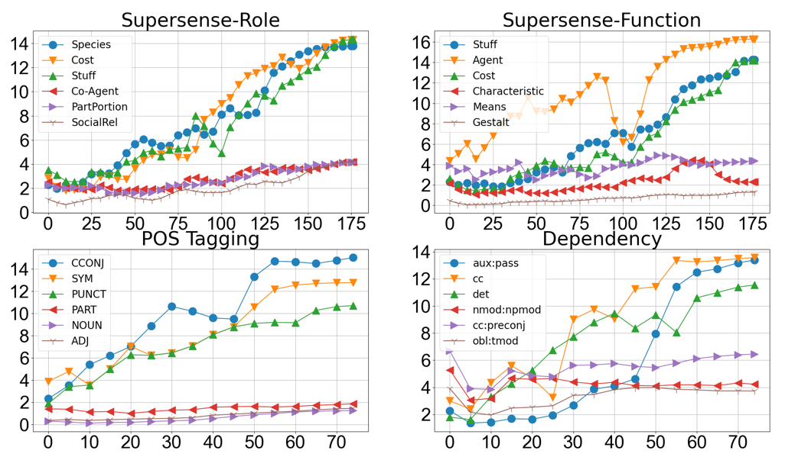{@style=text-align:left}

For clearity, we only present the three labels where the
mimimum distance increases the most, and three where it
increases the least. We also observe that although the trend
is increasing, the minimum distance of each label can
decrease during the course of fine-tuning, e.g. the label
STUFF in supersense role task, suggesting the instability of
fine-tuning.

To better understand how these labels move during the
fine-tuning, we compute the centroids of each cluster to
represent the label position. We select three closest labels
from the POS tagging task and track the paths of the
centroids of each label cluster in the last layer of
BERT-base during the fine-tuning. The following figure shows
the PCA projection in 2D of these paths.

 and last (right) layer of BERT-base."){@style=text-align:left}

We observe that before fine-tuning, the centroids of all
these three labels are close to each other. As the
fine-tuning proceeds, the centroids move around in different
directions and become far away from each other.

We conclude that fine-tuning pushes each label away from
others. This larger gap between labels admits more
classifiers consistent with the labels, and allows for
better generalization. Note that neither the loss function
nor the optimizer explicitly mandates this change. Indeed,
since in most cases, the labels are originally linearly
separable, the learner need not adjust the representation
at all.

### Cross-task Fine-tuning

In the last subsection, we hypothesiz that fine-tuning improves
the task performance by enlarging the gaps between label
clusters. A natural inference of this hypothesis is if we
can have a process that shrinks the gaps between labels, we
should be able to obersve a decreasing performance. In this
subsection, we investigate how fine-tuning for one task
affects another.

In this experiment, we fine-tune BERT-base on the PS-role
and POS tagging task separately and use the fine-tuned
models to generate contextualized representations for the
PS-fxn task. We choose PS-role because PS-role and PS-fxn
are similar tasks. On the other hand, POS tagging and PS-fxn
are contradicting tasks. POS tagging require all the
perpositions to be grouped together, while PS-fxn requires
differnt prepositions be to far away from each other.

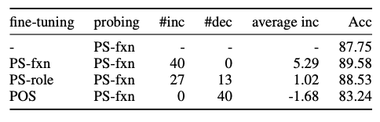{@style=text-align:left}

The above table summarizes our cross-task fine-tuning
results. The third and forth columns indicate the number of
labels whose minimum distance is increased or decreased
after fine-tuning. The second column from the right shows
the average distance change over all labels. From this table,
we observe that similar tasks (PS-role and PS-fxn) still increases
the distance (third row) but in a lesser extent comparing
the standarad fine-tuning process (second row). Also, we
observe a minor improvements when fine-tuning on a similar
task (87.75 --> 88.53). However, when we fine-tuning on a
contraticting task, the distances between clusters are all
decreasing (last row) and the performance decreases at the
same time (87.75 --> 83.24).

In summary, based on the last three subsections, we can
conclude that fine-tuning injects or removes task-related
information from representation by adjusting the distances
between label clusters *even if* the original representation
is linearly separable. When the original representation does
not support a linear classifier, fine-tuning tries to group
points with the same label into a small number of clusters,
ideally one cluster.

### Layer Behavior

At last, we will analyze the behaviors of different layers
of BERT representation. Previous work has already show that
lower layers changed little compared to higher layers. Here,
we are going to present more about the layer behaviors.

**Higher Layers Change More Than the Lower Layers {@style=color:royalblue}**

First, we quantitatively analyzing the changes to the
different layers. We use each cluster’s centroid to
represent each label’s position and quantify its movement by
computing the Euclidean distance between the centroids
before and after fine-tuning for each label, for all layers.
Following figure shows movements of POS tagging task using
BERT-base.

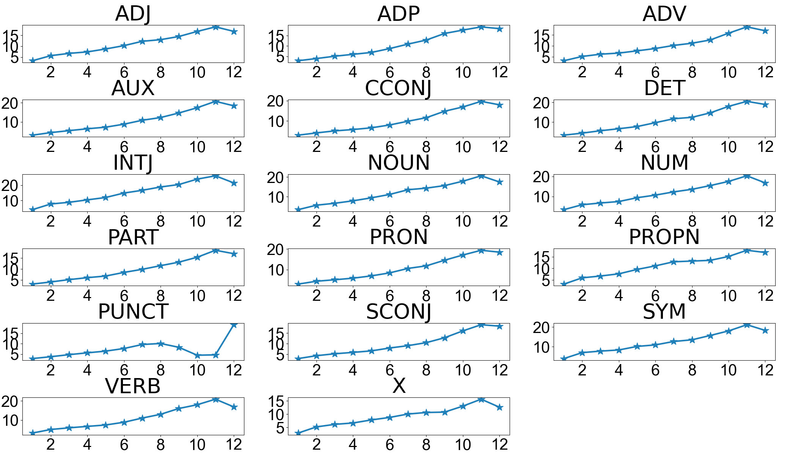{@style=text-align:left}

We can observe as the layer increases, the distance becomes
larger, suggesting higher layer change more than the lower
layers.

**Higher Layers Do Not Change Arbitrarily {@style=color:
royalblue}**

Although we can confirm that higher layer change more than
the lower layers, we find that the hihger layer sitll remain
close to the original representations. To study the dynamics
of fine-tuning, we compared the intermediate representation
of each layer during fine-tuning to its corresponding
original pre-trained one. The similarity between two
representations is calculated as the Pearson correlation
coefficient of their *distance vectors* as described
earlier.

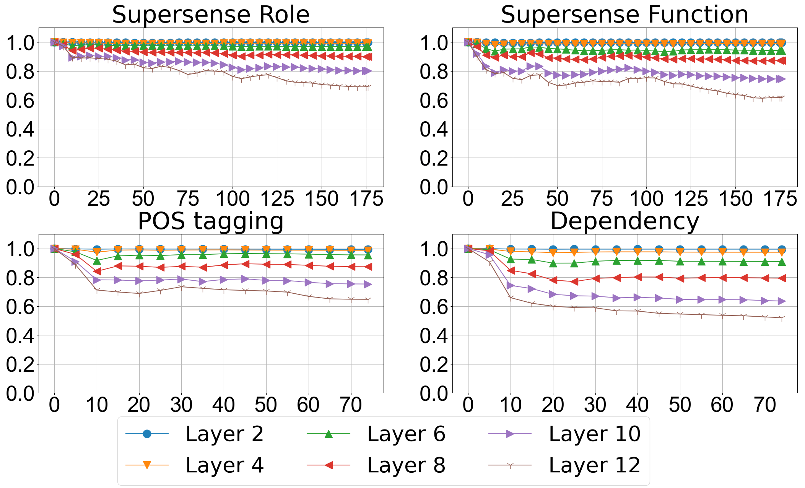{@style=text-align:left}

One important observation from the above figure is that even
if the higher layers change much more than the lower layers,
they do not change arbitrarily. Instead, the high Pearson
correlation coefficients of high layers show strong lienar
relation (more than $0.5$) between origial representation
and the fine-tuned one, suggesting fine-tuning pushes each
label away from each other while preserving the relative
positions of each label. This means the fine-tuning process
encode the task-dependent information while preserving the
pre-trained information as much as possible.

**The Labels of Lower Layers Move in Small Regions{@style=color:royalblue}**

To verify if the lower layers really do not change, for each
label, we compute difference between its centroids before
and after fine-tuning. Following figure shows the results.

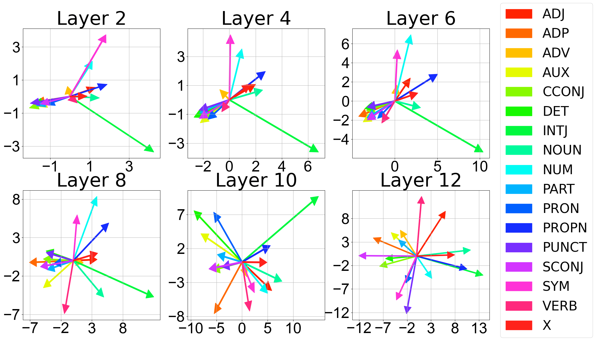{@style=text-align:left}

In the above figure, We observe that the movements of labels
in lower layers concentrate in a few directions compared to
the higher layers, suggesting the labels in lower layers do
change, but do not separate the labels as much as the higher
layers. Note that, the motion range of lower layers is much
smaller than the higher layers. The two projected dimensions
range from $−1$ to $3$ and from $−3$ to $3$ for layer two,
while for layer 12 they range from $−12$ to $13$ and $−12$
to $8$, suggesting that labels in lower layers only move
in a small region compared to higher layers.

## Conclusion

In this post, we ask and answer the following three
questions:

- Does fine-tuning always improve performance?
    - Indeed, fine-tuning almost always improves task
      performacne. However, **rare cases exist where
      fine-tuning decreases the performance.{@style=color:maroon}**
    - We also observe a divergence between training and test
      set after fine-tuning.
- How does fine-tuning alter the representation to adjust
  for downstream tasks?
    - **Fine-tuning alters the representation by grouping
      points with the same label into small number of
      clusters; {@style=color:darkorange}**
    - **And pushing each label cluster away from each other. {@style=color:darkorange}**
- How does fine-tuning change the underlying geometric
  structure of different layers?
    - **Higher layers do not change arbitrarily, instead, they
      remain simialr to the untuned vrsion. {@style=color:royalblue}**

[^1]: In most cases, the number of clusters equal to the
  number of labels. So, we use the clusters and labels
  interchangeablly.
